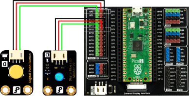

# Reaction Time Task

In this tutorial, you will learn how to use the [Harp Hobgoblin](https://github.com/harp-tech/device.hobgoblin) to implement a simple reaction time task, which will serve as our model systems neuroscience experiment. In this task, the subject needs to press a button as fast as possible following a stimulus, as described in the following diagram:

:::diagram

:::

The task begins with an inter-trial interval (`ITI`), followed by stimulus presentation (`ON`). After stimulus onset, advancement to the next state can happen only when the subject presses the button (`success`) or a timeout elapses (`miss`). Depending on which event is triggered first, the task advances either to the `Reward` state, or `Fail` state. At the end, the task goes back to the beginning of the ITI state for the next trial.

### Exercise 1: Generating a fixed-interval stimulus

In this first exercise, you will assemble the basic hardware and software components required to implement the reaction time task. Connect the LED to digital output channel `0` (`GP15`) on the `Hobgoblin`. Connect the pushbutton to digital input channel `0` (`GP2`) on the `Hobgoblin`. 

>[!TIP]
> You can use other digital input or digital output channels, but make sure to change the appropriate properties.

{width=520px}

Next, we will set up our `Hobgoblin`. 

:::workflow

:::

- Insert a [`Device`] operator and set the `PortName` property.
- Insert a [`DeviceDataWriter`] and set the `Path` property. Connecting it directly to the device ensures thats all events are logged.
- Insert a [`PublishSubject`] operator and name it `Hobgoblin Events`. 

This covers what we learned in the [Acquisition and Control](./hobgoblin-acquisition.md) tutorial. However we also want a way to send commands to the `Hobgoblin` without connecting directly to the input of the [`Device`] operator. 

- Right-click the [`Device`] operator, select `Create Source (Bonsai.Harp.HarpMessage)` > [`BehaviorSubject`]. Name the generated ``BehaviourSubject`1`` operator `Hobgoblin Commands`. Connect it as input to the [`Device`] operator.

>[!NOTE]
> A [source subject](https://bonsai-rx.org/docs/articles/subjects.html#source-subjects) is an operator that is set up to receive commands from multiple places in the workflow and pass them on to the `Hobgoblin`. When choosing a type for the `source subject`, choosing a [`BehaviorSubject`] instead of a [`PublishSubject`] ensures that the connection remains open until the workflow is stopped.

> [!NOTE]
> We will use this `device pattern` when setting up our `Hobgoblin` for the rest of the tutorials.

Lastly, we will set up a fixed-interval blinking LED as our stimulus.

:::workflow

:::

- Insert a [`Timer`] source and set its `DueTime` property to 1 second.
- Insert a [`CreateMessage`] operator, configure the `Payload` property to [`DigitalOutputSetPayload`], and set the [`DigitalOutputSet`] property to the `GP15` pin.
- Insert a [`MulticastSubject`] operator and configure the `Name` property to `Hobgoblin Commands`. This operator forwards `HarpMessages` it receives to `Hobgoblin Commands`.
- Insert a [`Delay`] operator and set its `DueTime` property to 200 milliseconds.
- Insert a [`CreateMessage`] operator, configure the `Payload` property to [`DigitalOutputClearPayload`], and set the [`DigitalOutputClear`] property to the `GP15` pin.
- Insert a [`MulticastSubject`] operator and configure the `Name` property to `Hobgoblin Commands`.
- Insert a [`Repeat`] operator.

### Exercise 2: Measuring reaction time

:::workflow

:::

- Insert a [`SubscribeSubject`] operator. Configure the `Name` property to `Hobgoblin Events`.
- Insert a [`Parse`] operator after `Hobgoblin Events`. Configure the `Register` property to [`TimestampedDigitalOutputSet`].
- Insert a [`SubscribeSubject`] operator. Configure the `Name` property to `Hobgoblin Events`.
- Insert a [`Parse`] operator after `Hobgoblin Events`. Configure the `Register` property to [`TimestampedDigitalInputState`].
- Run the workflow, and verify that both the stimulus and the button are correctly recorded.

>[!TIP]
> We use separate `Hobgoblin Events` operators to avoid issues with [branching](https://bonsai-rx.org/docs/articles/subjects.html#branching-subjects). See also [workflow guidelines](https://bonsai-rx.org/docs/articles/workflow-guidelines.html)

### Exercise 3: Analyzing reaction time

We will take a brief detour from Bonsai to look at how to visualize the data we have recorded. This section assumes you already have a python environment with [`pandas`](https://pandas.pydata.org/), [`matplotlib`](https://matplotlib.org/) and [`harp-python`](https://github.com/harp-tech/harp-python) installed.

```python
# Import harp-python for data interface and pandas for simple plotting
import harp
import pandas as pd 

# Load device reader
device = harp.create_reader("./data/device.yml")

# Load digital input and digital output
df_digital_output_set = device.DigitalOutputSet.read()
df_digital_input_state = device.DigitalInputState.read()

# Inspect dataframe
df_digital_output_set.head()
df_digital_input_state.head()

# Discard_unused_channels
df_digital_output_set = df_digital_output_set["GP15"]
df_digital_input_state = df_digital_input_state["GP2"]

# Keep digital_input_state == True values (when button is pressed)
df_digital_input_state = df_digital_input_state[df_digital_input_state == True]

# Extract valid responses (first button press that occurs within response_window, our ITI is ~1.2 second)
response_window = 1.0
valid_response_times = []
for led_on in df_digital_output_set.index:
    for button_press in df_digital_input_state.index:
        response_time = button_press - led_on
        if 0 < response_time < response_window:
            valid_response_times.append(response_time)

# Calculate and print hit/miss percentage
num_valid_responses = len(valid_response_times)
num_total_trials = len(df_digital_output_set.index)
hit_percentage = num_valid_responses / num_total_trials * 100
print(f"There were {num_valid_responses} valid responses out of {num_total_trials} trials, giving a hit rate of {hit_percentage}%")

# Plot valid response times
pd.Series(valid_response_times).plot(kind="box", ylim=(0,1), ylabel = "Response Times (seconds)", title = "Boxplot of valid response times")
```

<!--Reference Style Links -->
<!-- [`AnalogData`]: xref:Harp.Hobgoblin.AnalogData -->
<!-- [`AnalogDataPayload`]: xref:Harp.Hobgoblin.AnalogDataPayload -->
[`BehaviorSubject`]: xref:Bonsai.Reactive.BehaviorSubject
<!-- [`Boolean`]: xref:Bonsai.Expressions.BooleanProperty -->
[`CreateMessage`]: xref:Harp.Hobgoblin.CreateMessage
[`Delay`]: xref:Bonsai.Reactive.Delay
[`Device`]: xref:Harp.Hobgoblin.Device
[`DeviceDataWriter`]: xref:Harp.Hobgoblin.DeviceDataWriter
[`DigitalOutputSet`]: xref:Harp.Hobgoblin.DigitalOutputSet
[`DigitalOutputClear`]: xref:Harp.Hobgoblin.DigitalOutputClear
[`DigitalOutputClearPayload`]: xref:Harp.Hobgoblin.CreateDigitalOutputSetPayload
[`DigitalOutputSetPayload`]: xref:Harp.Hobgoblin.CreateDigitalOutputClearPayload
<!-- [`KeyDown`]: xref:Bonsai.Windows.Input.KeyDown -->
<!-- [`Merge`]: xref:Bonsai.Reactive.Merge -->
[`Parse`]: xref:Harp.Hobgoblin.Parse
[`MulticastSubject`]: xref:Bonsai.Expressions.MulticastSubject
[`PublishSubject`]: xref:Bonsai.Reactive.PublishSubject
[`Repeat`]: xref:Bonsai.Reactive.Repeat
[`SubscribeSubject`]: xref:Bonsai.Expressions.SubscribeSubject
[`Timer`]: xref:Bonsai.Reactive.Timer
<!-- [`TimestampedAnalogData`]: xref:Harp.Hobgoblin.TimestampedAnalogData -->
[`TimestampedDigitalOutputSet`]: xref:Harp.Hobgoblin.TimestampedDigitalOutputSet
[`TimestampedDigitalInputState`]: xref:Harp.Hobgoblin.TimestampedDigitalInputState
<!-- [`TimestampedDigitalOutputClear`]: xref:Harp.Hobgoblin.TimestampedDigitalOutputClear -->
<!-- [`Zip`]: xref:Bonsai.Reactive.Zip -->