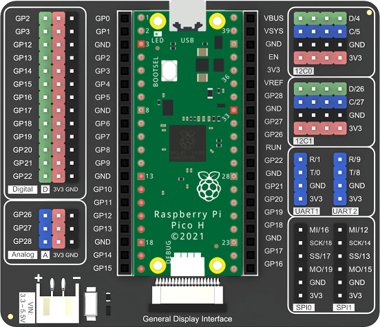

# Getting Started

{width=300}

The [Harp Hobgoblin](https://github.com/harp-tech/device.hobgoblin) is a simple multi-purpose device designed to help users learn the fundamentals of the Harp ecosystem. The principles demonstrated in this tutorial series can also be applied to other Harp devices.

> [!NOTE]
> The `Hobgoblin` can be assembled in multiple ways; this image above shows only one possible configuration. For more information on how to build one, refer to the resources in the device [repository](https://github.com/harp-tech/device.hobgoblin).

## Installation

- Install [Bonsai](https://bonsai-rx.org/docs/articles/installation.html).
- Install the `Harp.Hobgoblin` package by searching for it in the [Bonsai package manager](https://bonsai-rx.org/docs/articles/packages.html), using `nuget.org` as the package source.

## Flashing the Firmware

- Download the latest version of the [firmware](https://github.com/harp-tech/device.hobgoblin/releases/) that matches your Pico board.
- Press-and-hold the Pico `BOOTSEL` button while you connect the device to your computer's USB port. The Pico will be mounted as a new flash drive.
- Drag-and-drop the `.uf2` file into the drive.

## Testing the Device

:::workflow

:::

- Connect a pushbutton to analog input channel `0` (`GP26`) on the `Hobgoblin`.
- Hover over the workflow above, click the copy button in the top right corner, and paste it into Bonsai.
- Run the workflow and observe the output of `AnalogInput0`. The value should change when the pushbutton is pressed.

(TODO: Insert wiring diagram)

## Installing Harp-Python

The [harp-python](../articles/python.md) library provides an low-level interface to read and manipulate data from Harp devices. You can install `harp-python` within Python virtual environments by running:

```cmd
pip install harp-python
```

Alternatively, `harp-python` can also be installed with [`uv`](https://docs.astral.sh/uv/), an extremely fast and modern Python package and project manager.

- Install [`uv`](https://docs.astral.sh/uv/).
- Create a folder for the project (e.g., `hobgoblin_data`).
- Navigate to the folder and initialize a new project:

```cmd
uv init
```

- Install `harp-python` as a dependency:

```cmd
uv add harp-python 
```