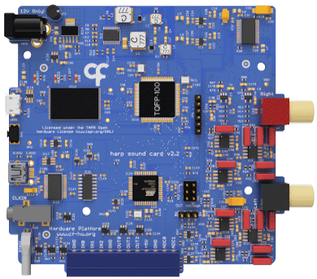

# Getting Started

The [Harp SoundCard](https://github.com/harp-tech/device.soundcard) is a high-performance audio device with two output channels using 24-bit DACs and a maximum sampling rate of 192 kHz.

{width=300}

## Installation

- Install the WinUSB driver if you plan to upload sounds to the onboard memory:
   - Download and launch [Zadig](https://zadig.akeo.ie/).
   - Connect the USB Micro-B cable to the computer.
   - Select the "Harp Sound Card" from the list. If the device is not available, go to "Options" > "List All Devices".
   - Select the "WinUSB" driver and click "Install Driver".
- Install [Bonsai](https://bonsai-rx.org/docs/articles/installation.html).
- Install the `Harp.SoundCard` package by searching for it in the [Bonsai package manager](https://bonsai-rx.org/docs/articles/packages.html).

Waveforms can be generated and uploaded to the `SoundCard` in Bonsai. Optionally, you can use the [Harp SoundCard GUI](https://bitbucket.org/fchampalimaud/downloads/downloads/Harp_Sound_Card_v1.3.2.zip) as a standalone interface for waveform management. This requires the [LabVIEW runtime](https://bitbucket.org/fchampalimaud/downloads/downloads/Runtime-1.0.zip) to be installed first.

## Connections

{width=450}

*<small>Single channel connection diagram with Harp Audio Amplifier and attached speaker. Reproduced from [Silva et al. (2024)](https://doi.org/10.1016/j.ohx.2024.e00555). CC BY 4.0.</small>*

**Amplifier** - The `SoundCard` requires an external amplifier. For high-fidelity applications, consider using the [Harp Audio Amplifier](https://github.com/harp-tech/peripheral.audioamp).

**Speaker** - The choice of speaker depends on the amplifier. For the `Harp Audio Amplifier`, any speaker with an impedance from 4 to 8 ohms can be used. The XT25SC90-04 (Peerless by Tymphany) has been tested and has a good frequency response up to 80 kHz.

## Testing the device

:::workflow

:::

- Hover over the workflow cell above, click the "Copy" icon in the top right, and paste the workflow into Bonsai.
- Set the `PortName` property of the [`SoundCard`](xref:Harp.SoundCard.Device) operator to the communications port of the `SoundCard` (e.g. COM7).
- Run the workflow. If the `SoundCard` is properly connected, you should hear a short tone.

 

---

These tutorials were written and tested with: 
**Hardware** v2.2 
**Firmware** v2.2 
**Harp.SoundCard** v0.2